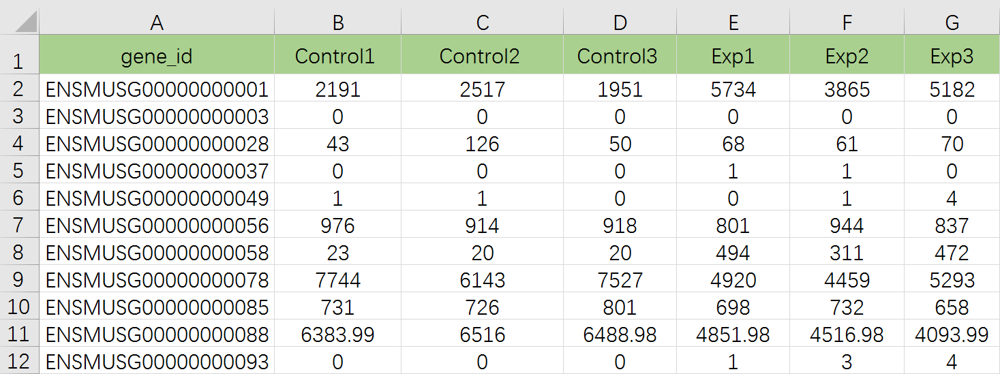
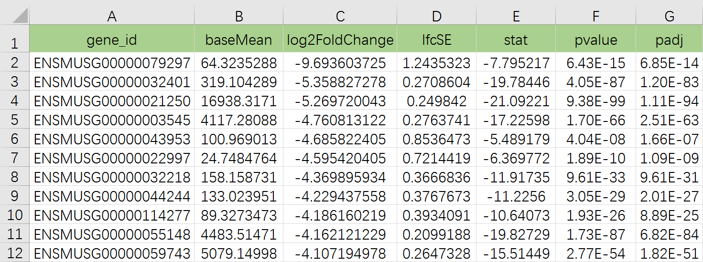
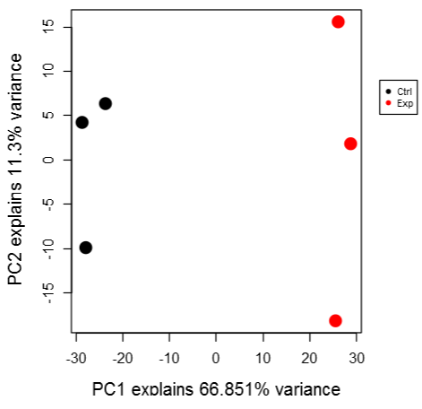
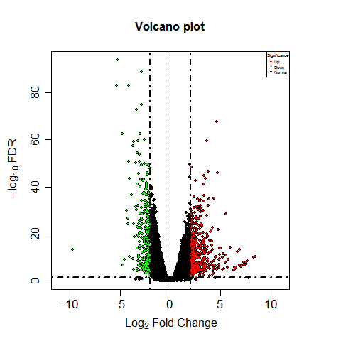
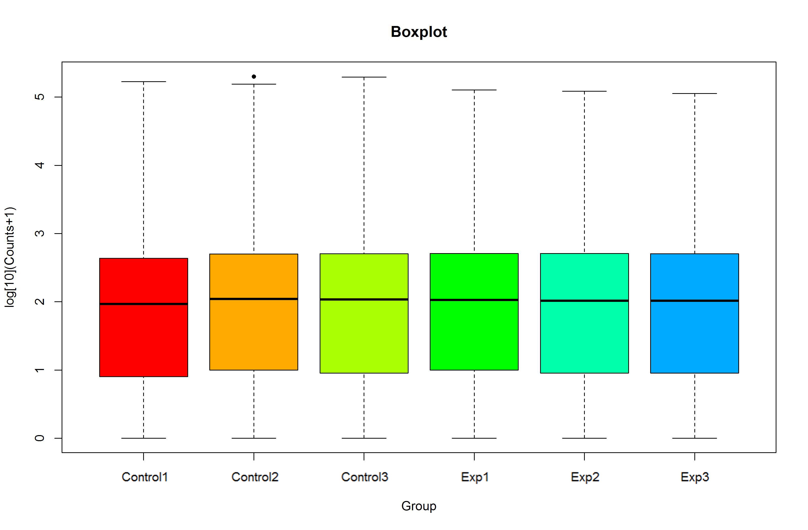
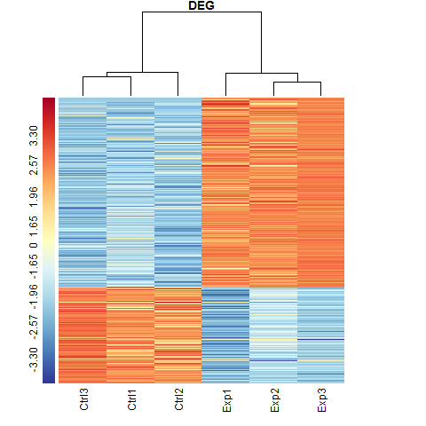
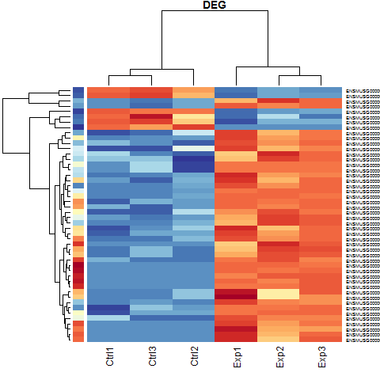

##### **The shiny-DEG app allows users to visualize differentitally expressed genes(DEG) starting with count data.**

- *Explore* the app's features with the example data set pre-loaded by clicking on the tabs above.
- *Upload* your data manually.

## Instructions

Code can be found on github: [https://github.com/sufangwang-npu/shiny-DEG](https://github.com/344968067/shiny-DEG)

To run this app locally on your machine, download R or RStudio and run the following commands once to set up the environment:

```r

install.packages(c("shiny","shinythemes","ggplot2","DESeq2","gplots","states","BiocGenerics","Bioparallel","DelayeArray","IRanges","S4Vectors","Biobase",,"RColorBrewer","DT")
## Try URL:https://rstudio.github.io/DT 
## You can download the R packages "DT",and learn more from
https://cran.r-project.org/web/packages/DT/DT.pdf
## IF you couldn't library the DT packages directly,please download DT packages and source(DT)
```

You may now run the shiny app with just one command in R:

```

shiny::runGitHub("shiny-DEG", "sufangwang-npu")
```

<a name="inputdata"></a> 

## Input Data

You may use this app by

1. Exploring the pre-loaded example data set.
   
   This is a pre-loaded mouse macrophages RNA-seq example for exploring the app's features.
2. Upload your own data that is Count data (or log2-expression data) which come from transcriptome sequencing.

<a name="dataformat"></a> 

### Data Format

- File must be the row counts,not normalized data,e.g.FPKM,TPKM,TPM.
- File must have a header row.
- First/Left-hand column(s) must be gene identifiers.
- First/Left-hand column(s) must be defined as row_name.

<a name="example"></a>

### Example of Data format

- Each row denotes a gene, each column denotes a sample.
  
  single factor data format:



multi-facor data format:


Example file: https://github.com/344968067/shiny-DEG/WWW

<a name="degtable"></a>

### DEG Table

- Column A provide gene name.
- Column C and column G provide Fold Changes and FDR,respectively.
- We use both log2FC and FDR to file DEG.



Analyzed data must contain some kind of expression measure for each sample  and a set of p-values with corresponding fold changes for those p-values. For instance, if you have a p-value for the comparison of control vs exp , you can  observe fold change or log2(fold change) between control vs exp. The fold changes are mainly used in the volcano plots. 

Example file: : [https://github.com/sufangwang-npu/shiny-DEG/WWW](https://github.com/sufangwang-npu/shiny-DEG)

<a name="vis"></a> 

## Visualizations

### Group Plots

<a name="pcaplots"></a>

#### PCA Plot

This plot uses Principal Component Analysis (PCA) to calculate the principal components of the expression data using data from all genes. Euclidean distances between expression values are used. Samples are projected on the first two principal components (PCs) and the percent variance explained by those PCs are displayed along the x and y axes. Ideally your samples will cluster by group identifier.



<a name="analysisplots"></a>

### Analysis Plots

These plots use the p-values and fold changes to visualize your data.

<a name="volcano"></a>

#### Volcano Plot

This is a scatter plot log fold changes vs –log10(p-values) so that genes with the largest fold changes and smallest p-values are shown on the extreme top left and top right of the plot. Hover over points to see which gene is represented by each point.

 (<https://en.wikipedia.org/wiki/Volcano_plot_(statistics)>)



<a name="boxplots"></a>

### Gene Expression Boxplot

Use the search bar to look up genes in your data set. For selected gene(s) the stripchart (dotplot) and boxplots of the expression values are presented for each group. You may plot one or multiple genes along side each other. Hover over points for more information about the data.



<a name="heatmaps"></a>

### Heatmap

A heatmap of expression values are shown, with genes and samples arranged by unsupervised clustering. You may filter on test results as well as P-value cutoffs. By default the top 100 genes (with lowest P-values) are shown.

![example5](example5.jpeg


